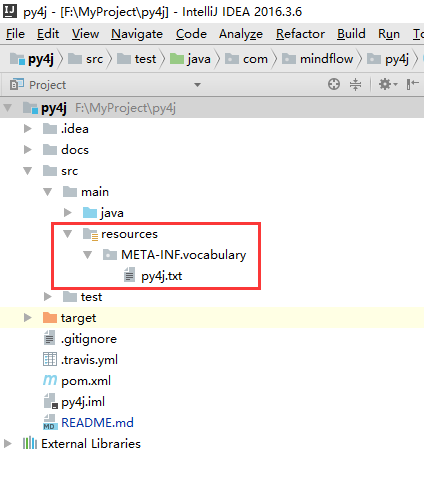

# Kitty
[](https://www.apache.org/licenses/LICENSE-2.0) [](https://github.com/TFrise/py4j/releases) [](https://travis-ci.org/TFrise/py4j)

## Overview
A open-source Java library for converting Chinese to Pinyin.

## Features
* solve Chinese polyphone
* support external custom extension dictionary

## maven dependency
```
<dependency>
    <groupId>com.mindflow</groupId>
    <artifactId>py4j</artifactId>
    <version>1.0.0</version>
</dependency>
```

## Usage
### 1. single char
```
Converter converter = new PinyinConverter();

char[] chs = {'长', '行', '藏', '度', '阿', '佛', '2', 'A', 'a'};
for(char ch : chs){
    String[] arr_py = converter.getPinyin(ch);
    System.out.println(ch+"\t"+Arrays.toString(arr_py));
}
```

output:
```
长	[chang, zhang]
行	[xing, hang, heng]
藏	[zang, cang]
度	[du, duo]
阿	[a, e]
佛	[fo, fu]
2	[2]
A	[A]
a	[a]
```

### 2. word
```
Converter converter = new PinyinConverter();

final String[] arr = {"肯德基", "重庆银行", "长沙银行", "便宜坊", "西藏", "藏宝图", "出差", "参加", "列车长"};
for (String chinese : arr){
    String py = converter.getPinyin(chinese);
    System.out.println(chinese+"\t"+py);
}
```

output:
```
肯德基	KenDeJi
重庆银行	ChongQingYinHang
长沙银行	ChangShaYinHang
便宜坊	BianYiFang
西藏	XiZang
藏宝图	CangBaoTu
出差	ChuChai
参加	CanJia
列车长	LieCheZhang
```

### 3.Extension vocabulary
Create a file named **py4j.txt** in your project's classpath **META-INF/vocabulary** directory.

Just like this:<br>



**py4j.txt** Content format:
```
bian#扁/便/便宜坊
du#读/都/度

```

## Performance Tips
> Py4j instances are Thread-safe so you can reuse them freely across multiple threads.

Testcase:
```
final String[] arr = {"大夫", "重庆银行", "长沙银行", "便宜坊", "西藏", "藏宝图", "出差", "参加", "列车长"};
final Converter converter = new PinyinConverter();

int threadNum = 20;
ExecutorService pool = Executors.newFixedThreadPool(threadNum);
for(int i=0;i<threadNum;i++){
    pool.submit(new Callable<Void>() {
        @Override
        public Void call() throws Exception {

            System.out.println("thread "+Thread.currentThread().getName()+" start");
            for(int i=0;i<1000;i++){
                converter.getPinyin(arr[i%arr.length]);
            }
            System.out.println("thread "+Thread.currentThread().getName()+" over");
            return null;
        }
    });
}

pool.shutdown();
```
